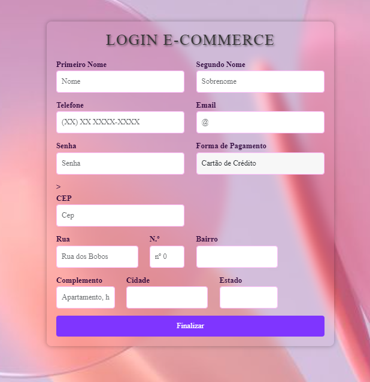

# E-commerce-

# Índice

[E-commerce]()  
[Introdução](#introdu%C3%A7%C3%A3o)  
[Descrição](#descri%C3%A7%C3%A3o)  
[Tecnologias ultilizadas ](#tecnologias-utilizadas)  
[Funcionalidade](#funcionalidade)  
[Fontes consultadas ](#fontes-consultadas)   
[Autores](#autores)  

# E-commerce 🔗

## Introdução 
Este é um projeto de exemplo para um sistema de login em um site de E-commerce. O projeto inclui um formulário de registro que coleta informações do usuário, como nome, telefone, email, senha, forma de pagamento e endereço.

## Descrição
O projeto consiste em uma página de registro de usuário para um site de E-commerce. Os usuários podem preencher os campos com suas informações pessoais e de entrega. O sistema também utiliza a API Via CEP para preencher automaticamente os campos de endereço com base no CEP fornecido pelo usuário.

## Tecnologias Utilizadas

A seguir, listamos as principais tecnologias utilizadas neste projeto:

| Tecnologia         | Descrição             |
|--------------------|-----------------------|
| VS Code (Visual Code) | Editor de código-fonte  |
| GitHub             | Plataforma de hospedagem de código |
| HTML               | Linguagem de marcação  |
| CSS                | Folhas de estilo em cascata |
| JSS                | Lib de estilo em JavaScript |

## Funcionalidade 
1-**Coleta de informações pessoais do usuário**, como nome, telefone, email, senha e forma de pagamento.

2-**Pesquisa de endereço** automática com base no CEP inserido pelo usuário, usando a API Via CEP.

3-**Validação dos campos** para garantir que os dados sejam inseridos corretamente.

4-**Botão de finalização** para concluir o processo de registro.

## Fontes consultadas 
Documentação do Bootstrap: (https://getbootstrap.com/docs/5.3)
Documentação da API Via CEP: (https://viacep.com.br)

## Autores 
Veronica Borges